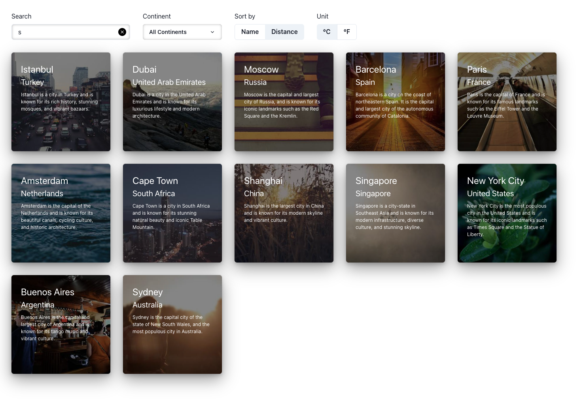
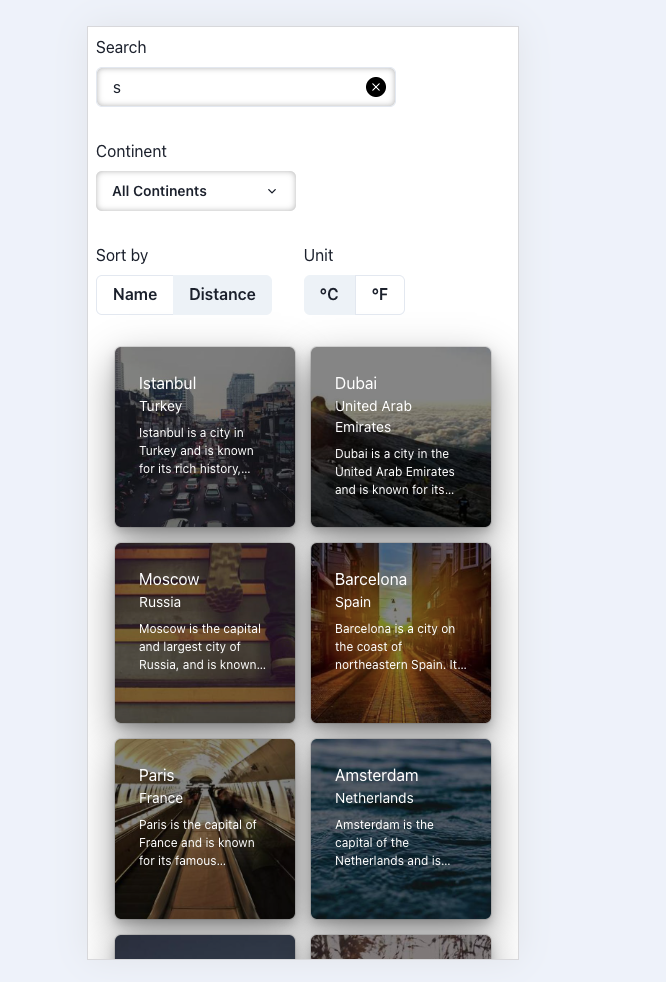
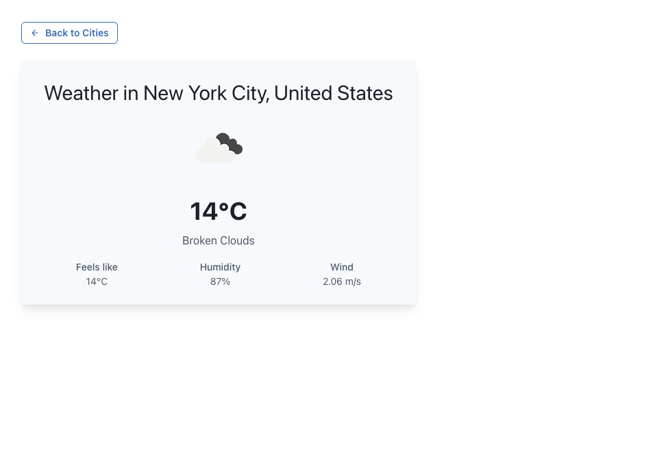
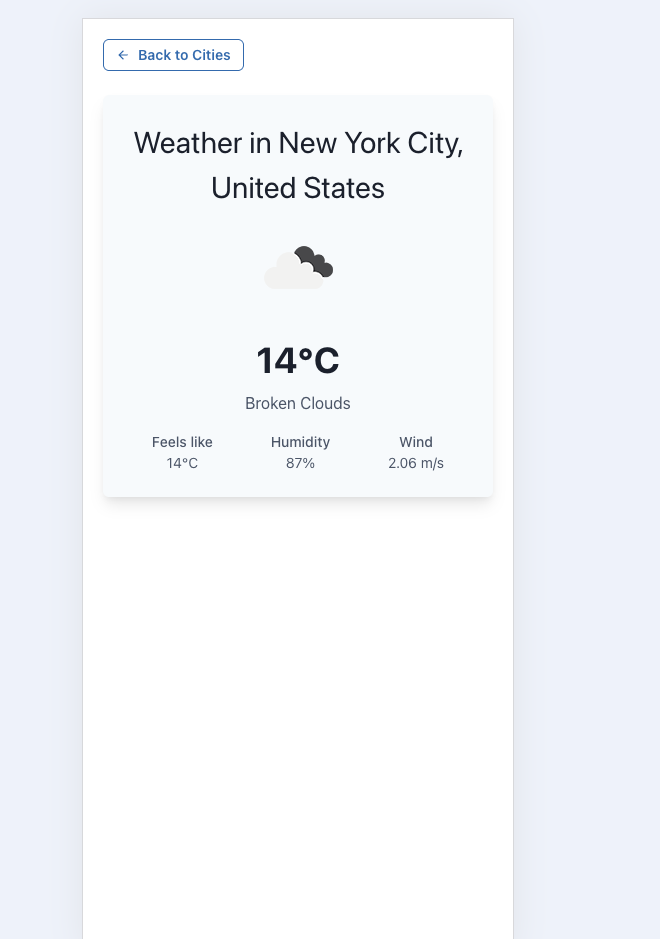

### Sunflower - Cities and Weather App

A responsive weather app built with **React**, **TypeScript**, and **Chakra UI**

### Getting Started

### `npm start`

### Features

- Search filter by name or country
- Filter by continent
- Sort by name or distance (from Tel Aviv)
- Unit toggle (°C / °F)
- Responsive design with animations
- Weather details + current temperature using OpenWeather API

### Libraries u might not know

- **Chakra UI** layout and styling system
- **Framer Motion** smooth, declarative animations
- **use-query-params** keeps filters synced with the URL hook
- **@turf/distance** geolocation distance calculations

### Notes!

- Forecast was intentionally excluded due to API limitations.
  OpenWeather's onecall v2.5 endpoint was deprecated in June 2024 and replaced by v3.0, which requires a paid subscription. I used only the free current weather API.
  deprecation link - https://openweathermap.org/api/one-call-api

- Query params (search, sort, unit, continent) are preserved across pages.
  I chose to store filters and UI state in the URL (via query params), rather than global state.
  This allows users to:
  - Share filtered links
  - Refresh without losing context
  - Navigate between pages with consistent state

### Screenshots

- Main Page
  
  

- Details Page
  
  
